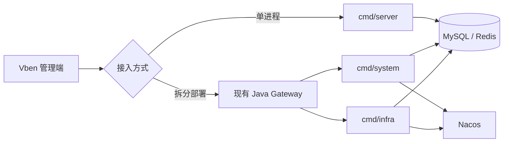

<p align="center"></p>
<h1 align="center">yudao-cloud-go</h1>
<p align="center">面向芋道 Cloud 的 Go 后端重构。当前阶段实现 system 与 infra，逐步走向可替换的服务。</p>
<p align="center">
  <a href="https://github.com/weilhuang/yudao-cloud-go/actions/workflows/ci.yml"></a>
  <a href="https://github.com/weilhuang/yudao-cloud-go/actions/workflows/docs.yml"></a>
  <a href="LICENSE"></a>
  <a href="CHANGELOG.md"></a>
</p>
<p align="center">
  <a href="docs/usage/index.md">使用说明</a> ·
  <a href="docs/development/index.md">开发说明</a> ·
  <a href="docs/refactor/index.md">重构过程</a>
</p>

## 项目定位

本项目用 Go 重构 [yudao-cloud](https://github.com/YunaiV/yudao-cloud) 的后端能力，目标是具备替换线上 Java 服务所需的功能、部署方式和验收证据。

第一阶段对齐 `yudao-cloud-mini` v2026.08（JDK 25）的 **system、infra** 功能作为固定对照范围，沿用官方 [Vben 管理端](https://github.com/yudaocode/yudao-ui-admin-vben) 核对前后端契约。

**当前版本 `0.0.1` 是开发预览版。** 它能用于本机运行、继续开发和接口对照；Java/Go 完整混跑、固定 Vben 浏览器流程、目标环境回滚和压测尚未完成，不能把它当成已经验收的生产替代品。[兼容范围与缺口](docs/usage/compatibility.md)会逐步随证据更新。

| 现在提供什么 | 对应代码或文档 |
| --- | --- |
| 单进程运行 system 与 infra 的已实现接口 | `cmd/server`、[快速开始](docs/usage/getting-started.md) |
| 拆分运行并接入现有 Java Gateway | `cmd/system`、`cmd/infra`、[部署说明](docs/usage/deployment.md) |
| 对齐已有的管理端、RPC、MySQL 与 Redis 契约 | `internal/system`、`internal/infra`、[测试说明](docs/development/testing.md) |
| 按功能继续扩展和验证 | [开发说明](docs/development/index.md) |

## 快速开始

准备 Go 1.24.3、Docker Desktop、Docker Compose、Git 和 OpenSSL。下面只展示启动顺序；初始化 SQL 含 `DROP TABLE`，请严格按[完整步骤](docs/usage/getting-started.md)导入**新建的本机空库**。

**SQL 在哪里：**本仓库没有复制整库 SQL。使用固定 Java 提交中的 [`yudao-cloud-mini/sql/mysql/ruoyi-vue-pro.sql`](https://github.com/yudaocode/yudao-cloud-mini/blob/712fc7c2528e434217833bf04e438bf18a9c96e4/sql/mysql/ruoyi-vue-pro.sql)；[快速开始](docs/usage/getting-started.md)的第 3 步给出克隆、切换版本和导入命令。

```bash
git clone https://github.com/weilhuang/yudao-cloud-go.git
cd yudao-cloud-go
./scripts/generate-dev-env.sh
set -a; . ./.env; set +a
docker compose -f deploy/docker-compose.yaml up -d --wait mysql redis
# 按使用说明导入固定 Java 基线 SQL
YUDAO_CONFIG=configs/config.yaml go run ./cmd/server
```

另开终端访问 `curl --fail http://127.0.0.1:48080/health` 。健康检查通过只说明进程和启动依赖可用；业务兼容性需要按[测试说明](docs/development/testing.md)继续验证。

### 管理端源码

固定的 Vben v2026.08 管理端以 Git 子模块放在 `ui/yudao-ui-admin-vben`，指向提交 `486870dd8496d94b79aaa183069df8407de8cbf9`。普通克隆适合只运行 Go 服务；需要前端联调时执行：

```bash
git submodule update --init ui/yudao-ui-admin-vben
git -C ui/yudao-ui-admin-vben rev-parse HEAD
```

第二条命令应输出上面的完整提交号。新克隆也可直接用 `git clone --recurse-submodules https://github.com/weilhuang/yudao-cloud-go.git`。管理端所需 Node.js、pnpm 版本和本机启动步骤见[前端联调](docs/usage/frontend.md)；`website/` 是文档站，两者独立。

## 运行结构



拆分部署沿用现有 Java Gateway；Go 服务注册为 `system-server`、`infra-server`。`/rpc-api/**` 依赖受信网络隔离，不能把 `tenant-id` 当作内部调用身份凭证。配置、网络边界和回滚要求见[使用说明](docs/usage/index.md)。

## 文档

| 阅读路径 | 适合谁 | 从哪里开始 |
| --- | --- | --- |
| **使用说明** | 想运行、配置、部署或评估替换范围 | [快速开始](docs/usage/index.md) → [配置](docs/usage/configuration.md) → [部署与回滚](docs/usage/deployment.md) |
| **开发说明** | 想修改代码、补测试或参与贡献 | [开发入口](docs/development/index.md) → [架构](docs/development/architecture.md) → [测试](docs/development/testing.md) |
| **重构过程** | 想按功能拆解，自己从零实现并与本项目对照 | [重构路线](docs/refactor/index.md) |

公开 Markdown 留在 `docs/`；VitePress 的依赖、配置、主题和静态资源放在 `website/`。[文档站维护](docs/development/site.md)说明本地预览和 GitHub Pages 发布。

**本地启动文档站：**准备 Node.js 24，在仓库根目录运行：

```bash
cd website
npm ci
npm run docs:dev
```

浏览器打开终端输出的地址。完整说明与构建命令见[文档站维护](docs/development/site.md#本机预览)。启动 Go 服务则看上面的[快速开始](#快速开始)。

## 致谢

感谢芋道开源团队提供后端与管理端代码。本项目使用它们的公开源码和行为作为重构参照：

- 完整后端：[yudao-cloud（GitHub）](https://github.com/YunaiV/yudao-cloud) 
- 后端基线：[yudao-cloud-mini（GitHub）](https://github.com/yudaocode/yudao-cloud-mini), v2026.08/JDK 25, commit `712fc7c2528e434217833bf04e438bf18a9c96e4`；
- 前端基线：[yudao-ui-admin-vben（GitHub）](https://github.com/yudaocode/yudao-ui-admin-vben),  v2026.08, commit `486870dd8496d94b79aaa183069df8407de8cbf9`。
- 项目内部设计还参考了 [go-backend-clean-architecture](https://github.com/amitshekhariitbhu/go-backend-clean-architecture)。

来源与第三方许可见 [NOTICE](NOTICE)。本项目是独立的 Go 重构项目，不代表上述上游项目。

## 参与项目

提交问题时请附版本、复现步骤和脱敏日志；安全问题按 [SECURITY.md](SECURITY.md) 私密报告。改代码前请看[贡献指南](CONTRIBUTING.md)和[开发说明](docs/development/index.md)。版本变化记录在 [CHANGELOG.md](CHANGELOG.md)。代码采用 [Apache-2.0](LICENSE)。
