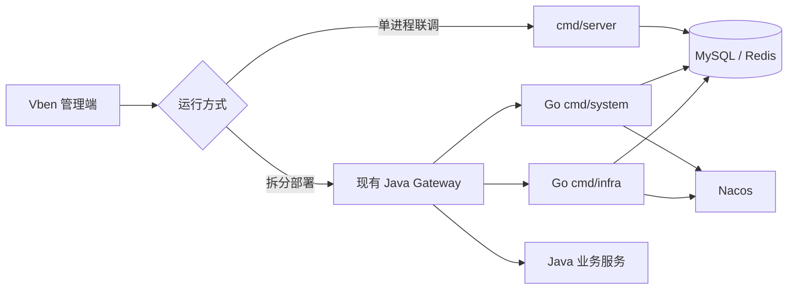

<p align="center"></p>
<h1 align="center">yudao-cloud-go</h1>
<p align="center"><strong>Go 承接 system、infra 基础服务；Java 继续承载业务服务。</strong></p>
<p align="center">在同一套芋道 Cloud 中对齐接口与数据契约，按服务受控切换并保留回滚路径。</p>

<p align="center">
  <a href="https://github.com/weilhuang/yudao-cloud-go/actions/workflows/ci.yml"></a>
  <a href="https://github.com/weilhuang/yudao-cloud-go/actions/workflows/docs.yml"></a>
  <a href="LICENSE"></a>
  <a href="CHANGELOG.md"></a>
</p>

<p align="center">
  <a href="https://weilhuang.github.io/yudao-cloud-go/"><strong>在线文档</strong></a> ·
  <a href="docs/usage/index.md">使用说明</a> ·
  <a href="docs/development/index.md">开发说明</a> ·
  <a href="docs/refactor/index.md">重构过程</a>
</p>

## 项目要解决什么

[yudao-cloud](https://github.com/YunaiV/yudao-cloud) 已有成熟的 Java 服务和管理端。本项目把 **`system`、`infra` 等基础服务**做成兼容的 Go 实现，目标是让 Go 基础服务与**继续运行的 Java 业务服务**组成可受控切换、可回滚的异构系统。业务模块不在本项目的 Go 重写范围内。

Go 基础服务以 [yudao-cloud-mini](https://github.com/yudaocode/yudao-cloud-mini) **v2026.08 / JDK 25** 的 `system`、`infra` 和对应 [Vben 管理端](https://github.com/yudaocode/yudao-ui-admin-vben)为固定对照。`cmd/server` 合并运行这两个基础模块；`cmd/system`、`cmd/infra` 则接入现有 Java Gateway 与 Nacos。Gateway 继续由 Java 提供。

> **当前状态：`0.0.1` 开发预览版。** `system`、`infra` 已有成体系的管理接口、内部调用入口和业务实现；静态路由分别命中 Java 基线 **212/212 + 56/56**、**101/102 + 6/6**（Controller + Feign）。这些数字是路径覆盖，尚不是行为验收。Java/Go 混跑、Vben 端到端和目标环境回滚仍需证明，**目前不能切换线上基础服务**。详见[基础服务能力对照](docs/usage/capability-comparison.md)和[兼容范围](docs/usage/compatibility.md)。

| 组成部分 | 当前进展 | 接下来要验证 |
| --- | --- | --- |
| Go `system` 基础服务 | Controller 路径 212/212、Feign 路径 56/56；包含登录、用户权限、租户、消息等功能 | 请求/响应与权限、租户、缓存的 Java/Go 差分 |
| Go `infra` 基础服务 | Controller 路径 101/102、Feign 路径 6/6；包含文件、配置、代码生成、日志等功能 | 文件通配符路由与下载行为、生成物差分 |
| Java Gateway 与业务服务 | 继续保留 Java；Go 有 `cmd/system`、`cmd/infra` 拆分入口 | 真实网关、服务发现、跨语言 RPC 和回滚演练 |

分子只是静态路径命中数；[逐功能对照表](docs/usage/capability-comparison.md)列出了 Java 细分能力、Go 对应入口和统计边界。完整 Cloud 中哪些业务服务实际启用，要以目标环境部署清单核实。

## 从哪里开始

| 想做的事 | 入口 |
| --- | --- |
| 了解项目、在线阅读 | [GitHub Pages 文档站](https://weilhuang.github.io/yudao-cloud-go/) |
| 本机运行 Go 服务 | [快速开始](docs/usage/getting-started.md) |
| 选择单进程或拆分部署 | [部署与回滚](docs/usage/deployment.md) |
| 核对 Java/Go 功能进度 | [基础服务能力对照](docs/usage/capability-comparison.md) |
| 修改代码、了解架构和测试 | [开发说明](docs/development/index.md) |
| 跟着 Java 基线自己写一遍 | [重构过程](docs/refactor/index.md) |

### 本机运行

需要 Go 1.24.3、Docker Desktop、Docker Compose、Git 和 OpenSSL。以下是启动顺序；**数据库 SQL 含 `DROP TABLE`，只能按[快速开始](docs/usage/getting-started.md)导入新建的本机空库**。SQL 使用固定 Java 提交的 [`sql/mysql/ruoyi-vue-pro.sql`](https://github.com/yudaocode/yudao-cloud-mini/blob/712fc7c2528e434217833bf04e438bf18a9c96e4/sql/mysql/ruoyi-vue-pro.sql)，本仓库没有复制整库文件。

```bash
git clone https://github.com/weilhuang/yudao-cloud-go.git
cd yudao-cloud-go
./scripts/generate-dev-env.sh
set -a; . ./.env; set +a
docker compose -f deploy/docker-compose.yaml up -d --wait mysql redis
# 现在按快速开始的第 3 步导入固定版本的 SQL，再启动服务
YUDAO_CONFIG=configs/config.yaml go run ./cmd/server
```

另开终端检查 `curl --fail http://127.0.0.1:48080/health`。健康检查只证明进程和启动依赖可用；接口兼容性要继续按[测试与验收](docs/development/testing.md)验证。

管理端是 `ui/yudao-ui-admin-vben` Git 子模块，固定在上游 v2026.08 的 `486870dd8496d94b79aaa183069df8407de8cbf9`。需要联调时运行 `git submodule update --init ui/yudao-ui-admin-vben`，再按[前端联调说明](docs/usage/frontend.md)启动。在线文档由独立的 `website/` 工程生成，与管理端不同。

## 运行方式与替换边界



拆分运行时，Go 服务以 `system-server`、`infra-server` 注册，Java 业务服务继续运行；替换路径需要验证 Java Gateway 的路由、跨语言调用和共享数据行为。`/rpc-api/**` 只应在受信网络中使用。**图中是目标组合，不表示动态切流已经验收。**切流条件和回滚步骤见[部署说明](docs/usage/deployment.md)。

## 文档与贡献

文档按三条路径组织：[使用说明](docs/usage/index.md)回答怎么运行和部署，[开发说明](docs/development/index.md)解释代码与测试，[重构过程](docs/refactor/index.md)提供可以跟做的功能拆解。Markdown 放在 `docs/`，VitePress 工程放在 `website/`；可直接访问[在线文档](https://weilhuang.github.io/yudao-cloud-go/)，也可按[文档站维护](docs/development/site.md)在本机预览。

欢迎提交可复现的问题和有测试证据的改动。请先看[贡献指南](CONTRIBUTING.md)；安全问题按 [SECURITY.md](SECURITY.md) 私密报告。版本变化见 [CHANGELOG.md](CHANGELOG.md)，代码采用 [Apache-2.0](LICENSE)。

## 致谢与来源

感谢芋道开源团队提供[完整后端 yudao-cloud](https://github.com/YunaiV/yudao-cloud)、[yudao-cloud-mini](https://github.com/yudaocode/yudao-cloud-mini) 和 [yudao-ui-admin-vben](https://github.com/yudaocode/yudao-ui-admin-vben)。本项目参考它们的源码与行为，也借鉴 [go-backend-clean-architecture](https://github.com/amitshekhariitbhu/go-backend-clean-architecture) 的职责划分。具体基线、第三方来源与许可见[兼容性说明](docs/usage/compatibility.md)和 [NOTICE](NOTICE)。本项目是独立的 Go 重构项目，不代表上游项目。
