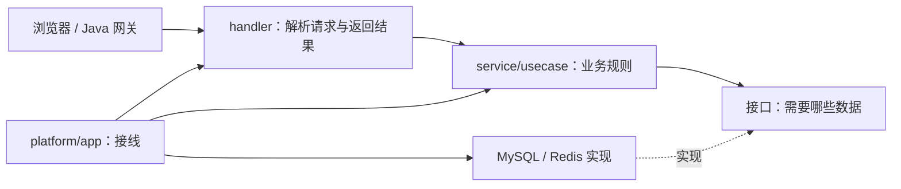
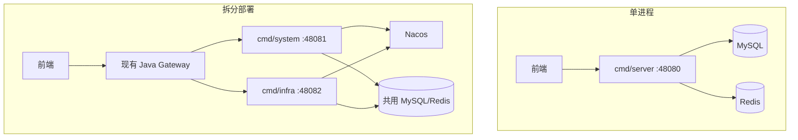
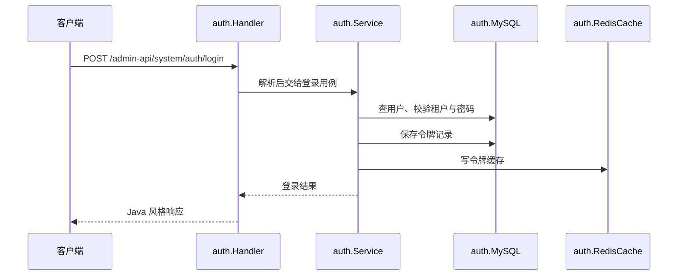

# 代码怎么分层

这页先给全貌。想深入读，可以按顺序看：

1. [上游模板的五层和依赖规则](architecture/01-principles.md)：哪部分来自参考项目，哪部分是 Clean Architecture 的一般原则。
2. [本项目的目录与部署映射](architecture/02-project-mapping.md)：为什么按功能分包、为什么保留三个 `cmd`。
3. [登录和发送 RPC 的真实请求路径](architecture/03-request-walkthrough.md)：接口怎样把用例与 MySQL 隔开。
4. [现有例外与改进顺序](architecture/04-tradeoffs.md)：哪些地方尚未达到依赖方向，怎样逐步改而不破坏 Java 合同。

上游仓库目前展示 Router、Controller、Usecase、Repository、Domain 五层；它用 MongoDB/JWT 做演示。本项目采用这套职责和依赖方向，因芋道兼容要求改用 MySQL/Redis、按业务功能组织文件。参考[上游源码与 README](https://github.com/amitshekhariitbhu/go-backend-clean-architecture)、[作者讲解](https://outcomeschool.com/blog/go-backend-clean-architecture)、[Clean Architecture 原文](https://blog.cleancoder.com/uncle-bob/2012/08/13/the-clean-architecture.html)和[Go 官方目录建议](https://go.dev/doc/modules/layout)；实际实现以本仓库源码为准。

这里借鉴 [go-backend-clean-architecture](https://github.com/amitshekhariitbhu/go-backend-clean-architecture) 的依赖方向：HTTP 负责收发，业务规则放在用例里，数据库是可替换的实现。我们按 `system`、`infra` 先分业务，再在每个功能目录内放 handler、service、store 和 MySQL/Redis 实现。这样找一个功能时，不用在全仓库的四个大目录间来回跳。

| 整洁架构里的职责 | 本仓库里去哪找 | 例子 |
| --- | --- | --- |
| Domain / Entity | 功能目录的 `model.go`、`error.go` | `internal/system/auth/model.go` |
| Use case | `service.go`、`usecase.go` | `internal/system/auth/usecase.go` |
| Repository port | `store.go` 或 service 定义的接口 | `internal/system/auth/store.go` |
| Repository adapter | `mysql.go`、`redis.go` | `internal/system/auth/mysql.go` |
| Controller / transport | `handler.go`、`rpc_handler.go` | `internal/system/auth/handler.go` |
| Router / composition root | `internal/platform/app/app.go` | `cmd/server/main.go` 调用它 |

代码评审时先看依赖方向：业务规则不要依赖 Gin 的上下文、SQL 行结构或 Nacos SDK；handler 不直接拼业务 SQL；MySQL/Redis 适配器不要反过来调用 HTTP。新功能可以在同一目录内分文件，不必为了“像模板”而复制目录名。当前旧代码并非每处都达到这个目标；新增功能按这条规则写，旧功能在修改时逐步收紧。

## 三种运行方式

`cmd/*` 只选配置和启动，不复制业务逻辑。`app.Start` 建立依赖并挂路由。单进程不注册 Nacos；拆分进程必须使用与 Java 侧相同的服务名。`/rpc-api/**` 目前依赖受信网络隔离，不能直接暴露到公网。网关仍由现有 Java 服务提供；是否移除它要另做路由、鉴权和限流验收。

## 一个请求怎么走

以登录为例：

读代码时先看 `auth/usecase.go` 的接口和行为，再看 `handler.go`，最后看 `mysql.go`/`redis.go`。同一个用例的单元测试应该能用内存替身跑起来；跨数据库、缓存和 HTTP 的行为用集成测试证明。

发送 RPC 是更小的例子：`sendrpc/handler.go` 只声明 `ContactReader`，`sendrpc/mysql.go` 实现它，`platform/app` 负责把两者接上。换一种联系人来源时，不用让 HTTP 代码认识 SQL。

## 改动时守住四条线

1. Java 和 Vben 的路径、字段、错误码、权限与租户语义是外部契约；内部可以重构，契约变更要先记录。
2. 一次迭代只切一个能验证的功能切片：handler、用例、适配器、测试、文档一起交付。
3. `app.go` 只接线。新增功能大到让它继续膨胀时，把对应注册函数移到功能包或独立装配文件。
4. 密钥从运行环境注入。服务发现、缓存和数据库的失败要显式暴露，不能假装健康。

## 目前还没整理完的地方

这是按整洁架构**逐步整理**的项目，不该把目录名字当成完成证明。`auth`、`directory`、`file` 等用例已经通过接口依赖 MySQL/Redis 实现；下面几处还把持久化细节放在了 service 里：

| 位置 | 现状 | 下一步怎么拆 |
| --- | --- | --- |
| `internal/infra/demo01`、`demo02`、`demo03` | `Service` 直接持有 `*sql.DB`，部分规则与 SQL 在同一文件 | 按一个 CRUD 切片提取用例需要的 Store 接口，事务放到适配器，先保住租户与批量删除测试 |
| `internal/infra/codegen` | `Service` 管理 SQL 事务、物理表探查和生成规则 | 分出表结构读取、定义仓储和生成器三个接口；先拿一张简单表做前后输出对照 |
| `internal/platform/app/app.go` | 装配入口集中，改一个模块时容易碰到其他模块 | 随新功能把对应依赖与路由挂载提成小的装配函数，保持三个 `cmd` 共用规则 |

这些是后续真实代码任务。当前不能宣称“所有包已经严格满足模板的依赖方向”；[重构过程](../refactor/index.md)给出了从一个功能切片开始整理的步骤。不要在没有 Java 对照和集成测试的情况下做全仓库搬家。
