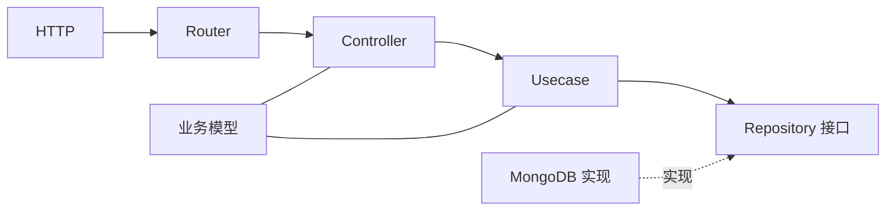

# 01：先理解上游模板的设计

这个项目参考的是 [go-backend-clean-architecture](https://github.com/amitshekhariitbhu/go-backend-clean-architecture)，不是照着它的目录复制。上游示例用 Gin、MongoDB、JWT，仓库把代码分为 Router、Controller、Usecase、Repository、Domain 五层；配套[作者文章](https://outcomeschool.com/blog/go-backend-clean-architecture)用任务接口演示 Controller 调用 Usecase、Usecase 通过 Repository 接口拿数据。这里先拆清楚**运行时调用方向**与**源码依赖方向**，再看我们为什么改目录。

## 五层分别负责什么

| 上游层 | 问题 | 上游示例 | 本项目要保留的原则 |
| --- | --- | --- | --- |
| Router | URL 交给谁 | `api/route` | 路由只选择 handler 和中间件 |
| Controller | 请求怎样转换 | `api/controller` | HTTP 输入输出留在边缘 |
| Usecase | 业务怎样决策 | `usecase` | 规则能脱离 Gin 与数据库测试 |
| Repository | 数据从哪来 | `repository`、`mongo` | 用例依赖需要的数据能力，不依赖连接细节 |
| Domain | 业务名词和合同 | `domain` | 模型与接口表达业务语言 |

箭头向右是**一次请求运行时的调用顺序**。源码中用例依赖的应是抽象接口；MongoDB 实现反过来满足接口。数据库可以替换，业务判断仍能运行。这一思路与 Robert C. Martin 的 [Clean Architecture 原文](https://blog.cleancoder.com/uncle-bob/2012/08/13/the-clean-architecture.html)中的依赖规则一致：越靠近业务核心，越不应知道外层框架和存储细节。

## 模板不是要逐字复制的规范

上游项目为了教学，把请求模型、数据库实体和接口集中放在 `domain`，其中个别模型直接带 BSON、JSON 标签。这个做法便于小示例阅读，但在复杂兼容项目中可能让数据库或 HTTP 格式进入业务模型。我们取的是**依赖方向**，不是“所有业务模型必须放一个顶层 `domain`”或“必须使用 MongoDB/JWT”。

Go 官方的[模块目录建议](https://go.dev/doc/modules/layout)也说明：服务器通常把内部实现放在 `internal`，多个可执行程序可集中在 `cmd`。因此本项目用三个 `cmd` 入口、一个 `internal` 业务树。这是 Go 项目布局与清晰依赖关系的结合，不是声称 Go 官方要求使用整洁架构。

## 用三句话判断一段代码的位置

1. 这段代码读 `gin.Context`、HTTP header 或写 JSON？放在 handler 或 HTTP 平台层。
2. 它判断租户、用户状态、验证码、权限或事务结果？先放用例；需要外部数据时定义小接口。
3. 它执行 SQL、Redis、Nacos、S3 或真实邮件发送？放在适配器或进程装配层。

复杂场景可能跨层，例如登录后写库与清 Redis。先画出失败路径，再决定事务和补偿放哪里。下一篇会把这套判断映射到本仓库的真实目录。
