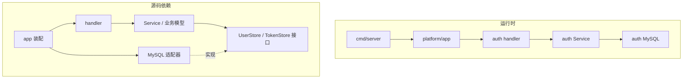
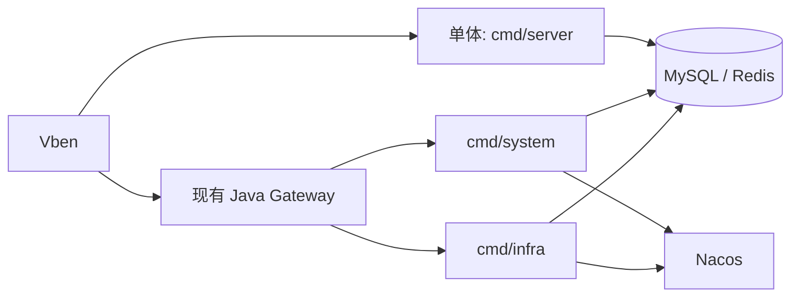

# 02：这个项目怎样落地

最终要让 Go 的 `system`、`infra` 基础服务与保留的 Java 业务服务在同一个系统里运行，因此 Go 的部署入口必须能接入现有 Gateway、Nacos 和数据层。当前代码提供了这些入口，且两个基础模块已有大量功能实现；逐功能进度见[能力对照](../../usage/capability-comparison.md)。动态切流、混跑一致性和回滚仍需按[兼容性门槛](../../usage/compatibility.md)验证。

如果照模板把全部 Controller 放在 `api/controller`、全部 Usecase 放在 `usecase`，找“用户导出”就得跨多个大目录。本项目先按芋道的 `system`、`infra` 划分，再把一个功能的 handler、用例、接口和适配器放在同一包里。改变的是**文件位置**，希望保住的是业务规则对外部细节的依赖方向。

## 目录地图

```text
cmd/
  server/              单进程入口
  system/              system 模块入口
  infra/               infra 模块入口
internal/
  platform/
    app/               把依赖装成进程
    config/             配置加载与校验
    httpx/              公共响应、路由与中间件
    db/ cache/ nacos/   外部基础设施
  system/
    auth/               登录、令牌、验证码
    directory/          用户、部门、角色、字典、租户
    sendrpc/            邮件、通知、短信 RPC
    ...
  infra/
    file/               文件配置、上传、下载
    codegen/            代码生成
    ...
```

| 上游模板 | 本仓库 | 为什么这样放 |
| --- | --- | --- |
| `api/route`、`bootstrap` | `internal/platform/app` 与各功能的 `Mount` | 三个入口共用装配规则 |
| `api/controller` | 各功能的 `handler.go` / `rpc_handler.go` | HTTP 契约跟功能放在一起 |
| `usecase` | 各功能的 `service.go` / `usecase.go` | 找业务规则只进一个包 |
| `domain` 中的接口 | 各功能的 `store.go` 或紧邻用例的小接口 | 接口由使用方按需求定义 |
| `repository`、`mongo` | 各功能的 `mysql.go`、`redis.go` 等 | 兼容现有 Java 的 MySQL/Redis |

Go 的 `internal` 有导入边界：仓库外的 module 不能直接导入这些包。它适合服务端内部实现，后续调整文件时不会承诺一个公开 Go SDK API；这点与 [Go 官方模块布局建议](https://go.dev/doc/modules/layout)一致。

## 两张图不要混淆



运行时确实会走到 MySQL；源码里的用例却只通过 `UserStore`、`TokenStore` 表达需要什么。看 `internal/system/auth/store.go` 和 `usecase.go`，再看 `internal/platform/app/app.go` 如何注入 `auth.MySQL`、`auth.RedisCache`。这比只看目录名更能判断设计。

## 为什么保留三个入口

Java 单体能一个进程跑 system 与 infra；微服务环境则让 Java Gateway 按 Nacos 服务名找 `system-server`、`infra-server`。我们用 `cmd/server`、`cmd/system`、`cmd/infra` 表示部署选择，业务规则仍在同一套 `internal` 包中。`cmd` 不应复制登录、文件或权限实现。



这里没有因为使用整洁架构就重写 Gateway。Gateway 的鉴权、路由、限流和灰度是另一组合同；目前拆分部署要沿用它，并在真实拓扑里验证。下一篇跟着具体请求走一遍。
