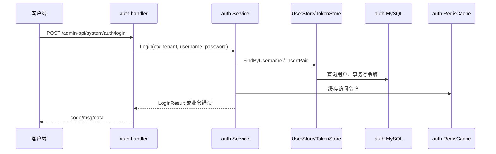

# 03：跟着真实请求看依赖方向

下面用两条已有代码路径：登录说明完整用例，发送 RPC 说明一次小范围接口反转。示意代码只摘取关键方法名，真正判断以链接的源码和测试为准。

## 登录：HTTP 不直接写令牌 SQL

1. `cmd/server/main.go` 读取配置并调用 `app.Execute`。
2. `internal/platform/app/app.go` 建 MySQL/Redis，组装 `auth.Service`，调用 `auth.Mount`。
3. `internal/system/auth/handler.go` 解析 `/admin-api/system/auth/login` 请求，交给 `Service.Login`。
4. `usecase.go` 比密码、查状态和租户、签令牌；`store.go` 定义需要的用户、令牌、缓存能力。
5. `mysql.go`、`redis.go` 提供具体实现；handler 将结果映射回 Java 风格响应。



`Service` 的字段是 `UserStore`、`TokenStore`、`TokenCache` 等接口；它不需要导入 Gin 或 `database/sql` 才能决定“密码错误”“用户禁用”“租户失效”怎样处理。可用 `go test -count=1 ./internal/system/auth` 看规则测试，再用集成测试核对 SQL 和 Redis。跨 Java/Go 的令牌格式仍需真实混跑证据。

## 发送 RPC：只把查收件人这一块反转

`internal/system/sendrpc/handler.go` 声明 `ContactReader`，只有 `AdminMobile`、`AdminEmail` 两个方法；`sendrpc/mysql.go` 用租户、用户 ID 和软删除条件实现查询；`app.go` 把 `&sendrpc.MySQL{DB: sqlDB}` 传给 `Mount`。

```go
type ContactReader interface {
    AdminMobile(ctx context.Context, tenantID, userID int64) (string, error)
    AdminEmail(ctx context.Context, tenantID, userID int64) (string, error)
}
```

这让“收件人从哪里来”可替换，handler 测试能给一个假的 `ContactReader`。但 **`sendrpc` 还不是严格独立的用例层**：handler 同时依赖 `auth.Service`、`message.Service` 并编排发送。后续若发送规则变复杂，应把“查收件人 → 模板渲染 → 发送与记录”移进用例，handler 只负责协议转换。现在不要把局部接口反转宣传成整个包已经完全整洁。

## 一次失败路径怎么测试

以管理员短信为例，至少区分：租户头缺失、用户不存在、收件人为空、发送器失败、成功。**现有 `sendrpc/handler_test.go` 只覆盖缺租户与邮件地址去重**；其余分支是后续应补的测试。练习时可先给 `ContactReader` 注入假实现，再为发送编排提取可替换的依赖；MySQL 查询条件由集成测试证明。特别是 `tenant-id` 只表示数据范围，不证明请求来自可信 Java 服务，`/rpc-api/**` 仍要靠网络边界保护。

从代码继续读：[登录学习站](../../refactor/03-auth.md)、[功能切片实战](../../refactor/09-feature-slice.md)、[安全边界](../../usage/security-model.md)。
