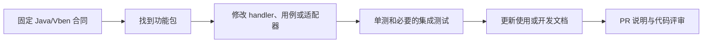

# 开发说明

这里面向要修改 `yudao-cloud-go` 的开发者。先确认一个功能在冻结 Java 和 Vben 中的行为，再改 Go，最后用相应层级的测试证明改动。只看路由是否存在，不能判断字段、权限或副作用是否相同。

## 开发入口

| 要解决的问题 | 文档 |
| --- | --- |
| 从接口找到代码，完成一次变更 | [开发手册](workflow.md) |
| 理解目录、依赖方向与三个启动入口 | [架构总览](architecture.md)及[架构专题](architecture/01-principles.md) |
| 选择单测、容器集成、Java 混跑与浏览器验证 | [测试与验收](testing.md) |
| 修改 VitePress 文档站 | [文档站维护](site.md) |
| 维护版本与发布检查 | [开源发布检查](release.md) |

## 一次变更怎么走

功能代码主要在 `internal/system` 和 `internal/infra`；HTTP/RPC 入口由各包挂载，`internal/platform/app` 负责依赖装配。单进程与拆分进程共用这些包。新功能按实际职责定义小接口，不需要为了模仿模板而增加空层；已有代码中的架构例外在[改进顺序](architecture/04-tradeoffs.md)中列出。

提交前至少运行 `go test -count=1 ./...`、`go vet ./...`、`go build ./cmd/...`。改动涉及 MySQL、Redis、Nacos 或跨 Java 契约时，再按[测试章节](testing.md)跑对应的真实依赖与混跑场景。贡献流程见仓库根目录的 [CONTRIBUTING.md](https://github.com/weilhuang/yudao-cloud-go/blob/main/CONTRIBUTING.md)。
