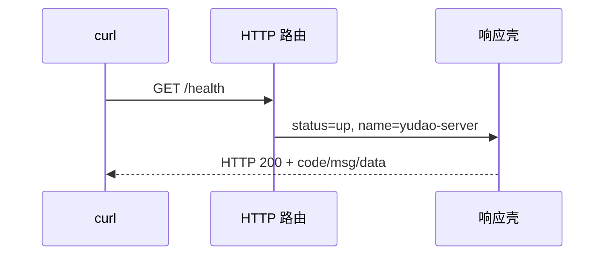

# 01：先让一个进程可靠地活着

这站先不碰数据库。目标是：浏览器请求 `/health` 有固定响应；配置错了就明确报错；按 Ctrl-C 可以关掉服务。先用标准库做一遍，再看本项目为什么用 Gin 装路由。

## 任务 1：最小 HTTP 服务

在自己的练习目录执行 `go mod init example.com/yudao-study`，建 `cmd/server/main.go`。先用 `net/http` 注册 `/health`，监听 `:48080`。响应约定是 `{"code":0,"msg":"成功","data":{"status":"up","name":"yudao-server"}}`，`Content-Type` 为 `application/json`。先用 `curl -i http://127.0.0.1:48080/health` 看状态码和包体。



别急着把所有路由都放 `main.go`。把公共响应放在 `internal/platform/httpx`，让 `cmd/server` 只负责启动。本仓库可对照 `internal/platform/httpx/router.go` 和 `result.go`。Go 的 `internal` 表示只有这个 module 内的代码能导入它。

## 任务 2：给配置一个边界

定义 `Config`，至少有应用名、监听地址、MySQL DSN、Redis 地址。写 `Load`：默认值、YAML、环境变量依次覆盖；写 `Validate`：缺必填值时在监听端口前失败。可先只校验 HTTP 字段，下一站再加入 MySQL/Redis。每一步写一个测试：YAML 值能读到、环境变量能覆盖、空地址会报错。本仓库可对照 `internal/platform/config/config.go`。

需要理解的是：`os.Getenv` 到处调用会让测试很难隔离。让 `main` 读取一次配置，再把 `Config` 传入应用装配函数。

## 任务 3：启动与退出

把 `http.Server` 和监听器组在一个 `Start(ctx, cfg)` 中，返回一个可以 `Shutdown(ctx)` 的对象。Ctrl-C 时给正在处理的请求一个短的退出窗口。再写测试：启动后 `/health` 成功；调用 `Shutdown` 后监听端口不再接受新连接。

这一步会碰到 `context.Context`：它用来传“取消”和截止时间，不是放全局变量的袋子。对照 `internal/platform/app/app.go` 的 `Start`、`Shutdown`、`Execute`，看看资源关闭顺序。

## 本站检查点

```bash
go test -count=1 ./...
go vet ./...
go run ./cmd/server
curl --fail http://127.0.0.1:48080/health
```

能解释“为什么配置验证发生在监听之前”“为什么 handler 不直接调用 `os.Getenv`”，再进入下一站。现在的健康检查只说明 HTTP 进程活着；接入 MySQL/Redis 后要重新定义何时算健康。
