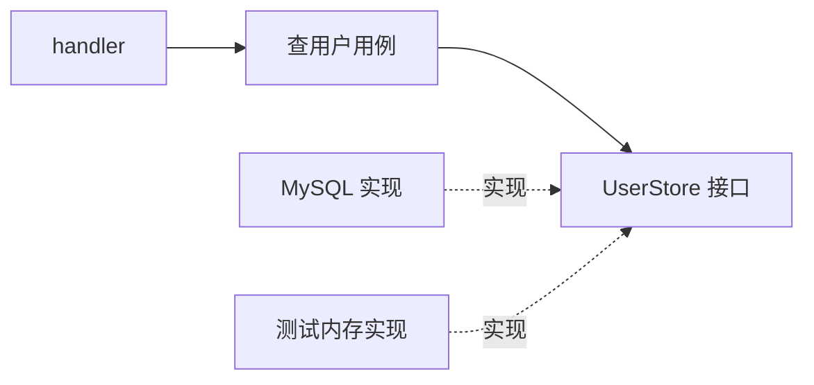
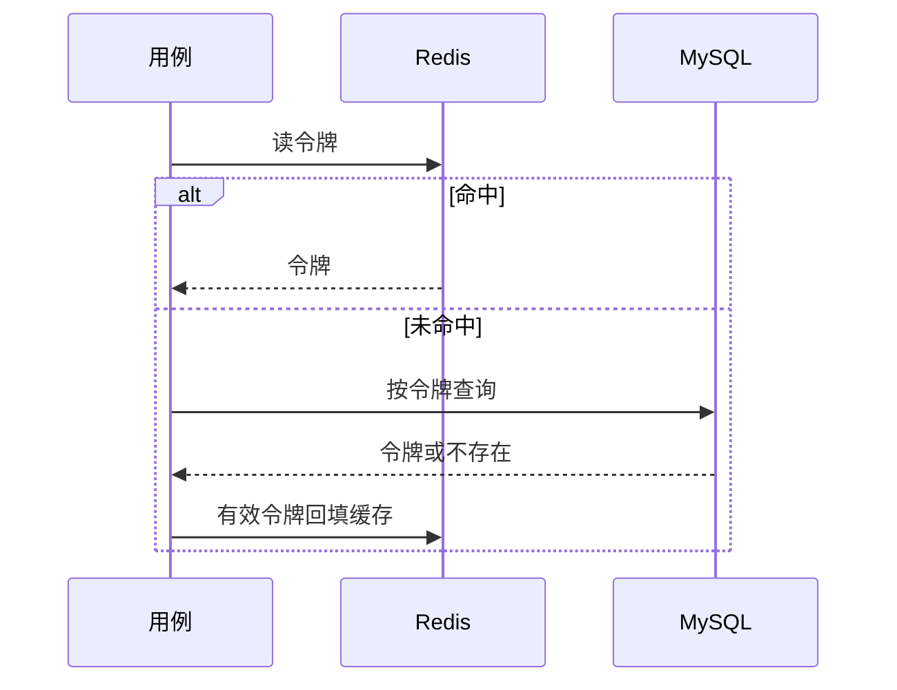

# 02：让业务规则不认识数据库驱动

这一站用一个很小的查询练习依赖方向：按租户和账号查用户。先让用例能用假的存储器测试，再接 MySQL；接着用 Redis 做一次缓存。对照代码在 `internal/system/auth/store.go`、`mysql.go`、`redis.go`。



## 任务 1：先写用例需要的接口

在练习项目的 `internal/system/auth` 中定义简化版接口：

```go
type UserStore interface {
    FindByUsername(ctx context.Context, tenantID int64, username string) (*User, error)
}
```

写一个 `Service` 保存 `Users UserStore`。让 `FindUser` 拒绝空账号，并调用接口。测试里用一个只保存 map 的内存实现：存在、不存在、底层报错各测一次。接口放在用例旁边，因为是用例决定自己需要哪些数据。

## 任务 2：换成 MySQL

用 `database/sql` 加 MySQL 驱动实现接口。SQL 查询必须带租户条件；账号是参数，不拼进 SQL 字符串。启动时 `PingContext`，连不上就不要提供 `/health`。记得关闭 `*sql.DB`。本仓库对照 `internal/platform/db/mysql.go` 和 `internal/system/auth/mysql.go`。

用 Testcontainers 起**临时** MySQL，建最小的用户表和两条不同租户的同名用户：查询 A 租户不能返回 B 租户的用户。再测数据库不可达时启动失败。这比仅 mock `sql.DB` 更能发现 SQL 与表结构的问题。

## 任务 3：加 Redis，但保留回源

用令牌查询做缓存练习：先读 Redis；未命中再读 MySQL；写入令牌后更新 Redis；登出时删除缓存。不要让“Redis 连不上”被误当成“令牌不存在”。本仓库对照 `auth.TokenStore`、`TokenCache` 与 `auth.Service`，再看 `internal/platform/app/app.go` 如何注入两种实现。



## 本站检查点

- 内存实现的单元测试不需要 Docker。
- MySQL 测试能证明租户隔离，不只证明“查到一行”。
- Redis 未命中和 Redis 故障是两种结果。
- `go test -tags=integration -count=1 ./...` 在 Docker 可用时通过。

接下来才把查用户、校验密码和签令牌串成登录。
