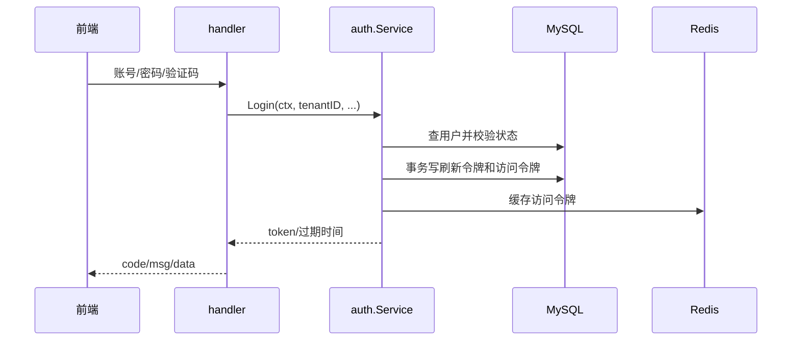
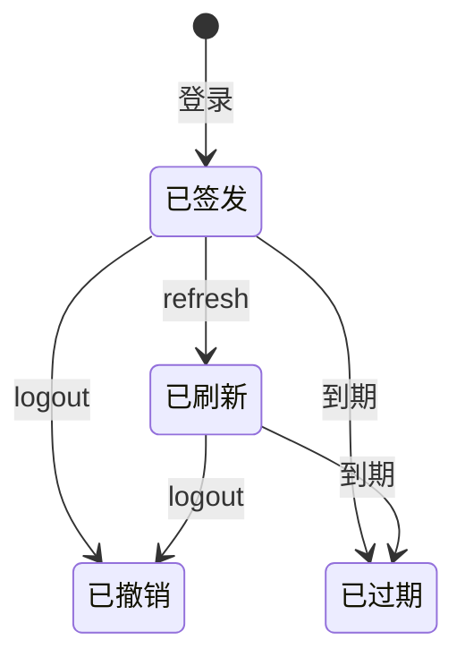

# 03：从登录到令牌

把登录拆成五个小任务做：**查人、验密码、验状态与租户、签发令牌、记录结果**。先写前两步的单元测试，再接令牌存储。源代码对照 `internal/system/auth/usecase.go`、`handler.go`、`store.go`。

## 任务 1：账号密码

密码用 bcrypt 哈希比较，不保存明文。不存在的用户和错误密码给同一种外部错误，避免让接口暴露账号是否存在。测试正确密码、错误密码、禁用用户、跨租户用户。你可以给 `Service` 注入一个内存 `UserStore`，用真实 bcrypt 哈希写测试，完全不需要 MySQL。

## 任务 2：验证码和租户

验证码启用时必须先校验票据；租户失效时不能发令牌。把“租户是否可用”作为 `Service` 的一个依赖，由装配层接到目录服务，不让 `auth` 反向依赖 `directory`。对照 `auth.Service.ValidateTenant` 和 `CaptchaChecker`。验证码关闭与开启各写失败用例。

## 任务 3：签发、刷新、登出

先画出访问令牌和刷新令牌的生命周期：

刷新令牌和访问令牌写库要么一起成功，要么一起失败；Redis 是加速读取的一层。测试同一用户多次登录、刷新令牌错误、过期、登出后再访问。与 Java 混跑时还要对齐令牌表、Redis 键和值、租户和客户端编号，这部分只能靠集成与混跑测试确认。

## 任务 4：HTTP 错误与登录日志

handler 只做字段解析、调用用例、把业务错误写成 Java 前端理解的 `code/msg/data`。失败登录也要记日志，但日志不应含明文密码、令牌或验证码。试着构造一条错误密码请求，检查返回和日志都符合预期。

## 本站检查点

你应能分别回答：密码比较在哪一层、事务边界在哪里、Redis 故障怎么处理、租户校验由谁注入。再跑 `go test -count=1 ./internal/system/auth` 和相关 `integration` 测试。不要用单元测试结果代替与 Java、Vben 的真实对照。
