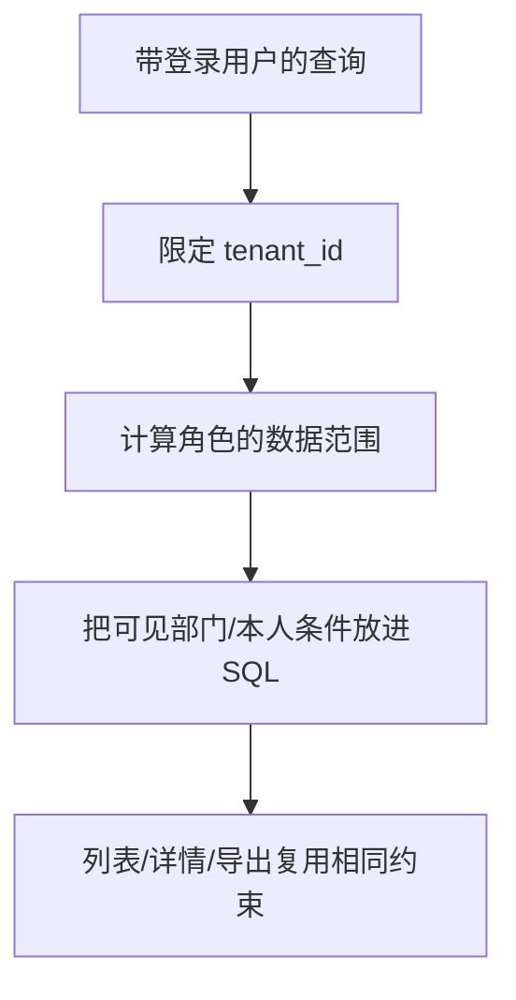

# 04：用户、部门和权限

登录成功只能证明“是谁”，还不能证明“能看哪条数据”。这一站先完成一个用户切片，再接部门范围和角色/菜单。对照 `internal/system/directory`、`internal/system/permissionrpc`。

## 任务 1：用户新增与查询

把新增用户拆成输入校验、同租户账号唯一性、岗位校验、bcrypt 哈希、写数据库。查询用户时也带租户条件。每一步要有能观察的失败结果：缺字段、账号重复、岗位不存在或禁用、数据库错误。对照 `directory.Service.CreateUser`，看它怎样只依赖 `UserWriter` / `AccessStore` 接口。

## 任务 2：列表别漏数据权限

管理员 A 可以看所有部门，管理员 B 只能看自己部门及子部门，管理员 C 只能看本人。给测试数据库准备三部门、四用户，分别查列表、详情、导出；不能出现“列表过滤了，导出却全量”的情况。

这里的难点是“权限条件进入查询”，不是拿到全量结果后用 Go 过滤。后者会让分页总数和导出出错，还可能提前把敏感数据读进进程。对照 `directory.UserAccess`、`DeptScope` 和 `user_scope.go`。

## 任务 3：角色、菜单与缓存

写入角色/授权后，登录中的用户不应继续看到旧菜单；与 Java 共用 Redis 时，Java 侧缓存也要失效。测试先读缓存、改角色、再读权限。缓存删除失败不能伪装成“操作完全成功”。对照 `directory.JavaRoleCache` 和相关集成测试。

## 任务 4：分页、导入与导出

选一个用户列表接口，依次做筛选、排序、分页、导出；用同一批测试数据对照 Java 的字段、时间格式、长整数和空值。导入要分别测重复账号、跨租户岗位和部分失败时的结果。不要先追求所有接口数量，先把一个完整链路做对。

## 本站检查点

- 账号和岗位约束在同租户内生效。
- 列表、详情、导出都按相同的数据范围返回。
- 角色变更后 Go 和 Java 的权限缓存有可观察的失效结果。
- 每个行为有对应的单元或 MySQL/Redis 集成测试；浏览器中的菜单与按钮还要单独验收。
