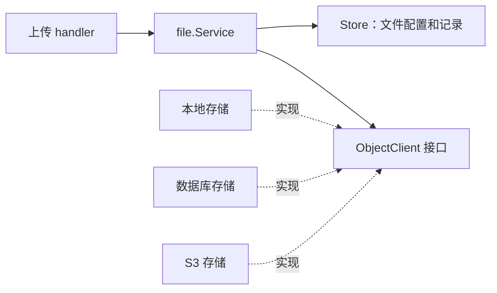

# 05：做一个可以换存储器的文件服务

文件上传很适合练习整洁架构：前端只关心上传结果，业务用例关心文件路径和记录，存储器可以是本地盘、数据库或 S3。对照 `internal/infra/file`。

## 任务 1：只做本地上传

限制空文件、单文件大小和整请求大小。路径不能让用户用 `../` 跳出存储根目录。写入成功后保存文件记录并返回访问 URL。测试同名文件、空文件、恶意路径和写入失败。看 `file.Service.Upload`、`path.go`、`local.go`。

## 任务 2：抽出存储器接口

从本地实现中提炼 `Upload/Delete/Get/PresignPut/PresignGet` 的契约。先给用例注入一个内存存储器，在不启动 S3 的情况下测“写对象后写记录”。然后再接数据库和 S3。接口由用例提出；不要把 AWS SDK 类型放到 handler 或业务模型里。

## 任务 3：补偿和下载

问自己：对象写成功、记录写失败时怎么办？删除记录成功、对象删除失败时怎么办？把这些失败写成测试，再决定补偿或重试策略。下载要核对路径、权限、MIME、缓存头和存储器的实际行为；同名 HTTP 路由存在并不等于完成 Java 兼容。

## 任务 4：其他 infra 功能用同样方法练习

| 小功能 | 先做的最小场景 | 重点测试 |
| --- | --- | --- |
| 配置管理 | 一个配置项的读取/更新 | 缓存失效、租户边界 |
| 数据源管理 | 保存一个加密的连接配置 | 密钥错误、密码不进日志 |
| API 日志 | 一次请求的脱敏记录 | 令牌/密码不落库 |
| 代码生成 | 一张简单表的预览 | 生成文件与 Java 基线对照 |

做一个小功能就提交一次，不要把所有 infra 先写成一个大 `Service`。对照目录里的 `service.go`、`handler.go`、`mysql.go`，看看哪些地方符合依赖方向，哪些还可以在下一轮收紧。

## 本站检查点

同一套 `file.Service` 测试能用内存对象存储器运行；真实本地存储和 S3 的关键行为另有集成测试；上传失败不会留下无法解释的文件记录。最后再用固定 Java/Vben 基线检查路径、响应和权限。
