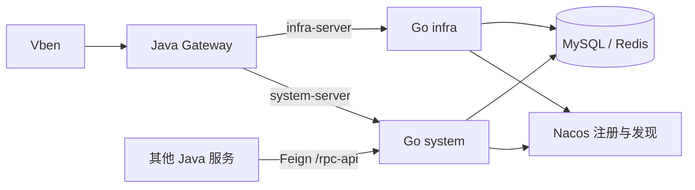

# 06：从单进程走到拆分服务

前几站的业务用例都不应知道自己跑在 `cmd/server` 还是 `cmd/system`。这站只改变**装配方式**：同一套能力由不同入口选择性挂载，并让现有 Java Gateway 能找到 Go 进程。

## 任务 1：拆入口，不复制用例

保留 `cmd/server` 单进程入口；新增 `cmd/system`、`cmd/infra`，只给它们不同的配置和功能挂载。对照 `cmd/*/main.go` 和 `internal/platform/app/app.go`。测试三个入口的健康检查名字、端口、路由集合；不能因为拆进程把登录或文件 API 挂错服务。

## 任务 2：注册到 Nacos

服务名与 Java 对齐，注册地址必须是网关可达的地址。启动失败时不要挂出假健康实例；退出时先从 Nacos 注销，再停 HTTP。Testcontainers 可以验证注册与注销，但网关真实路由还要在预生产里测。对照 `internal/platform/nacos` 和 `app_integration_test.go`。

## 任务 3：走一条 Java RPC

选 Java 中一条真实 Feign 调用，例如读取用户或字典。固定 Java 请求里的路径、方法、header、参数、返回包体和错误码；用 Go 实现，并运行 Java→Go 混跑测试。`tenant-id` 不应被当成内部身份认证，RPC 端口只允许可信服务访问。路径数量对上以后，还要比权限、数据范围和副作用。

## 任务 4：浏览器和回滚

固定 Vben SHA，在浏览器里走登录、列表和一个修改操作。记录请求、返回、页面和数据库变化。然后模拟 Go 实例摘流，确认 Java 实例接管；若写入数据无法被 Java 读回，就不能算回滚成功。

## 本站检查点

单体和拆分入口都通过集成测试；至少一条关键 RPC 经 Java/Go 真实混跑；Vben 浏览器用例及失败路径有证据；预生产回滚能恢复服务并保持共享数据可读。全部完成后才讨论等条件压测，完整门槛见[测试手册](../development/testing.md)。
