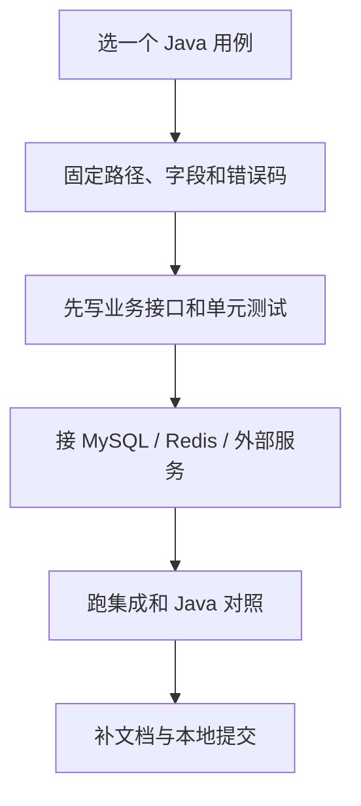

# 07：其余功能怎么一块块做

前六站把骨架搭起来了，下面继续按“**一个入口 + 一条业务规则 + 一种持久化 + 对应测试**”推进。表里的源码位置是本仓库的对照答案，不是让你一口气复制整个包。每做完一格，先说清楚正常、失败、跨租户和并发时各会发生什么，再与固定 Java 基线比。

## system：先把用户体系做完整

| 小任务 | 第一条闭环 | 别漏的验收 | 对照代码 |
| --- | --- | --- | --- |
| S01 验证码 | 生成一张图并校验一次票据 | 过期、重复使用、开关关闭 | `internal/system/captcha` |
| S02 登录日志 | 成功和失败各记一次 | 密码/令牌脱敏、失败也落库 | `internal/system/logger` |
| S03 用户 CRUD | 新增、查详情、修改、禁用 | 同租户唯一、密码哈希、禁用后令牌 | `internal/system/directory` |
| S04 部门和岗位 | 建部门、选岗位、查树 | 循环父子关系、跨租户、禁用岗位 | `directory/dept_*.go`、`mysql_post.go` |
| S05 角色和菜单 | 授权一角色并读菜单 | 数据范围、按钮权限、缓存失效 | `directory/access.go`、`cache.go` |
| S06 租户 | 创建并切换一个租户 | 到期、配额、跨租户请求 | `directory/tenant.go` |
| S07 字典 | 建类型和值并查询 | 缓存与 RPC 返回一致 | `directory/dict.go`、`rpc_dict.go` |
| S08 用户导入导出 | 导入两行、导出查询结果 | 错行报告、数据范围、长整数 | `directory/user_import.go`、`user_excel.go` |
| S09 权限 RPC | Java 服务查一次部门权限 | header、租户、错误与超时 | `internal/system/permissionrpc` |
| S10 角色岗位 RPC | Java 服务查一次角色/岗位 | 缓存与数据权限一致 | `internal/system/rolepostrpc` |
| S11 租户与发送 RPC | 读租户、触发一次受控发送 | 内网边界、失败不重复发 | `tenantrpc`、`sendrpc` |

## 身份与消息：对外部系统先画边界

| 小任务 | 第一条闭环 | 别漏的验收 | 对照代码 |
| --- | --- | --- | --- |
| I01 OAuth 客户端 | 读取一个客户端配置 | 客户端禁用、密钥不进日志 | `internal/system/identity` |
| I02 授权码/令牌 | 授权、换令牌、刷新 | code 一次性、作用域、过期 | `identity/authorize.go`、`exchange.go` |
| I03 社交登录 | 一个渠道的绑定/解绑 | state、防重放、跨租户 | `identity/social_rpc.go`、`state.go` |
| I04 微信相关 | 一条消息或登录 RPC | 签名、超时和错误码 | `identity/wechat.go`、`wx_rpc.go` |
| M01 站内通知 | 发一条、标已读 | 只读自己的消息、重复标记 | `internal/system/message` |
| M02 邮件模板 | 渲染模板，再接发送器 | 缺变量、脱敏、发送失败 | `message/render.go`、`smtp.go` |
| M03 短信模板 | 生成验证码并发送 | 频控、有效期、原子消费、无固定验证码 | `auth/smscode.go`、`message/sms_vendor.go` |
| M04 WebSocket 通知 | 在线管理员收到公告 | 断线、租户隔离、重复投递 | `internal/platform/ws` |

外部邮件、短信和社交服务在单元测试里用假实现；真实渠道凭据只放测试环境的密钥管理里。不要为了“跑通测试”把实际发送动作混进普通 CI。

## infra：把资源和配置做扎实

| 小任务 | 第一条闭环 | 别漏的验收 | 对照代码 |
| --- | --- | --- | --- |
| F01 文件上传 | 本地保存一张小图 | 大小上限、路径穿越、记录一致 | `internal/infra/file` |
| F02 文件下载与删除 | 用文件 ID 读回并删除 | MIME、权限、对象与记录的补偿 | `file/handler.go`、`service.go` |
| F03 多存储器 | 切换数据库/本地/S3 | 主配置、预签名、失败隔离 | `file/db.go`、`local.go`、`s3.go` |
| C01 配置项 | 读写一个系统配置 | 缓存失效、并发覆盖 | `internal/infra/config` |
| C02 数据源 | 加密保存一个连接配置 | Java AES 兼容、错误密钥、无明文日志 | `internal/infra/datasource` |
| C03 API 日志 | 记录一条访问与错误 | 脱敏、请求体上限、写入失败 | `internal/infra/apilog` |
| C04 代码生成 | 一张简单表的预览 | 字段类型、模板输出、主子表另测 | `internal/infra/codegen` |
| C05 Redis 监控 | 列一次键或统计 | 权限、超大键、服务保护 | `internal/infra/redismonitor` |
| C06 Demo 表 | 一个完整 CRUD | 分页、租户、事务 | `internal/infra/demo01`～`demo03` |

## 平台与交付

| 小任务 | 第一条闭环 | 别漏的验收 | 对照代码 |
| --- | --- | --- | --- |
| P01 地区/IP | 查地区树和一个 IP | 数据来源许可、未知 IP、并发 | `internal/system/area` |
| P02 表格 | 读写 CSV/XLSX | 编码、大小、公式注入 | `internal/platform/sheet` |
| P03 清理任务 | 过期记录被清理一次 | 重跑幂等、误删边界 | `internal/platform/job` |
| P04 HTTP 外壳 | 响应、异常、请求 ID | 大整数、CORS、敏感字段 | `internal/platform/httpx` |
| P05 模块间 RPC | 一条 Java→Go 调用 | 网络隔离、服务发现、权限 | `internal/platform/rpc`、`cmd/*` |

最后回到[测试手册](../development/testing.md)逐层验收。某个功能在 Go 目录里“已有文件”，只说明有实现；是否覆盖 Java 的整个功能，还要看固定版本的接口、数据和运行证据。
