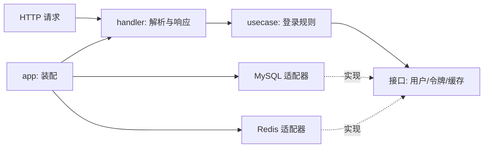

# 08：从 Java 项目走到 Go 代码

这章给熟悉 Spring Boot 的开发者一个定位图。两边的职责可以对应，但不要照类名机械翻译：Go 更适合围绕一个用例定义小接口，由启动装配层把实现接上。

| 在 Java 项目里常见的东西 | 在本项目去哪找 | 迁移时最容易漏什么 |
| --- | --- | --- |
| `@RestController` / DTO | 功能包的 `handler.go`、`model.go` | 请求校验、错误码、长整数字符串化 |
| `@Service` | `service.go`、`usecase.go` | 事务与缓存失效的顺序 |
| Mapper / Repository | `store.go` 接口与 `mysql.go` 实现 | 租户条件、软删除、分页总数 |
| `@Configuration` / Bean 注入 | `internal/platform/app/app.go` | 三个入口是否接了相同规则 |
| `@FeignClient` | `rpc_handler.go`、各 `*rpc` 包 | header、异常、超时、内部网络边界 |
| `application.yml` | `configs/*.yaml`、`config.Load` | 环境变量覆盖和必填密钥 |

## 从请求反查一条业务链

先拿 `/admin-api/system/auth/login` 练习：在 `internal/platform/app/app.go` 找到 `auth.Mount`，到 `internal/system/auth/handler.go` 找路径，再看 `usecase.go` 的业务判断，最后看 `mysql.go` / `redis.go`。每到一层，写下这一层**知道什么、不应该知道什么**。

Java 的依赖注入常靠框架扫描；这里的依赖关系能在 `app.go` 直接看到。好处是测试可把 MySQL/Redis 换成内存实现。代价是装配代码可能变长，所以新模块要保持清晰的注册函数。

## `context.Context` 与事务

Go 的 `context.Context` 随请求向下传，用于取消和超时。不要把密码、数据库连接或全局配置塞进 `context`。数据库事务也不是自动加一个注解：用例要明确决定哪些写入必须一起成功，适配器负责 `BeginTx`、提交和回滚。练习时画出“写令牌记录 → 写 Redis 缓存 → 返回”的失败路径，再看现有实现怎样处理。

## 错误不是异常堆栈

用例返回 `error`，handler 把已知业务错误转成 Java 前端理解的 `code/msg/data`。底层错误不要原样返回给浏览器，尤其是含 DSN、SQL、文件路径的错误。试着给一个假的 Store 返回错误，分别检查 HTTP 响应和日志是否泄露细节。

## 本章练习

1. 选一个字典查询接口，画出它的 Java Controller → Service → Mapper，与 Go handler → usecase → MySQL 的对应关系。
2. 找到一条跨租户的失败测试，说明租户条件在哪层进入 SQL。
3. 用 `go test -count=1 ./internal/system/auth` 验证用例；再解释这个命令为什么证明不了真实 Java Feign 调用。

下一章用一条真实功能切片把这些点串起来。
