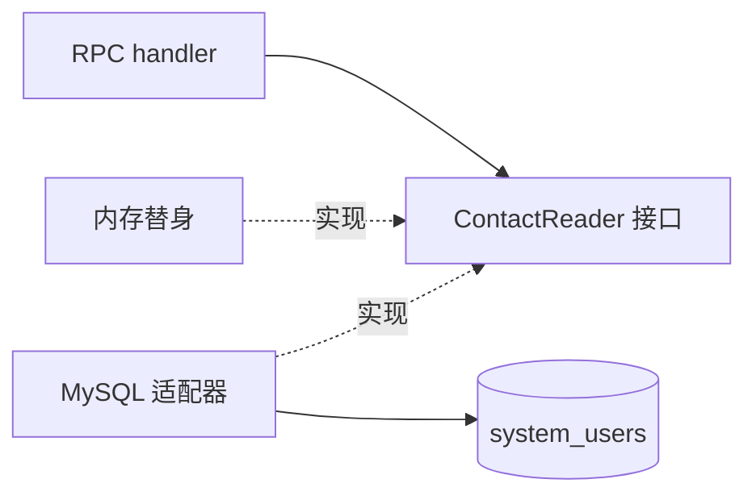

# 09：亲手做一条功能切片

前几章把入口、用例、数据和部署分开讲了。这一章把它们放到同一条路径里：**按租户和管理员 ID 读取邮箱，再由一个受信 RPC 发模板邮件**。现有代码在 `internal/system/sendrpc`；练习请在自己的分支或练习仓库做，做完再对照。这里聚焦架构，真实发送器要用假实现，避免测试发出邮件。

## 先固定合同

不要一上来写 SQL。先写下 Java 调用方关心的内容：

| 项 | 本次练习的检查 |
| --- | --- |
| 路径和方法 | `POST /rpc-api/system/mail/send/send-single-admin` |
| 数据范围 | 用 `tenant-id` 限定管理员，跨租户 ID 查不到 |
| 输入 | `userId`、`templateCode`、`templateParams` |
| 输出 | Java 风格 `code/msg/data`；错误不能返回数据库口令 |
| 网络 | RPC 入口仅给可信服务，不能用租户头充当身份 |

真正与 Java 一致的字段、空值和错误码以固定源码与混跑测试为准；表格是做练习时先核对的清单。

## 任务 1：定义用例要的数据

在功能包里定义一个只读接口。先写一个内存实现，分别返回邮箱、不存在和错误。用例或 handler 不应接触 `*sql.DB`。

```go
type ContactReader interface {
    AdminEmail(ctx context.Context, tenantID, userID int64) (string, error)
}
```

这不是“所有数据读取都做一个 Repository 大接口”。接口只放本次用例需要的方法。现有 `sendrpc.ContactReader` 还包含 `AdminMobile`，因为同一个包也处理短信。

## 任务 2：把 SQL 放到适配器

用 `database/sql` 实现 `AdminEmail`，查询同时包含 `id`、`tenant_id` 和 `deleted=0`。参数通过占位符传入；列名如果必须动态选择，只能从代码内的固定集合选，不能直接接用户输入。对照 `sendrpc/mysql.go`。



集成测试准备两个租户的用户，对同一 ID 或相似账号做跨租户查询。只测“能查到邮箱”不足以证明隔离。

## 任务 3：只在边缘处理 HTTP

handler 解析 `tenant-id` 和 JSON，调用用例/发送器，映射成 `code/msg/data`。先测缺租户、空模板、用户不存在、发送器失败、成功。不能因为 HTTP 返回 200 就把业务失败算成功；还要看 `code`。看 `sendrpc/handler.go` 和 `handler_test.go`。

现有 `sendrpc` 的发送编排仍在 handler，是[架构例外](../development/architecture/04-tradeoffs.md)。如果你继续加频控、模板规则或重试，应先把这些规则移进一个不依赖 Gin 的用例，再让 handler 只做协议转换。

## 任务 4：在装配层接线

`internal/platform/app/app.go` 创建 `&sendrpc.MySQL{DB: sqlDB}` 并传给 `sendrpc.Mount`。单体和 system 入口共用该装配规则；不要在三个 `cmd` 内分别写 SQL 和路由。

## 做完怎么验收

```bash
go test -count=1 ./internal/system/sendrpc
go test -tags=integration -p 1 -parallel 1 -count=1 ./internal/system/sendrpc
go vet ./internal/system/sendrpc
```

第二条只有包里有 `integration` 测试时才会运行该测试；还要检查输出有没有 `SKIP`。真实 Java Feign 对照、网络隔离和发送渠道行为仍要在[混跑验收练习](10-contract-lab.md)里单独证明。
