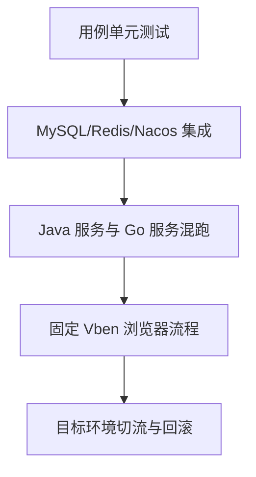

# 10：把“接口能返回”变成“合同可验收”

重写项目最容易出现的错觉是：同名路由有了，单元测试也绿了，于是认为 Java 可以下线。这章教你为一条接口建立**请求、数据、副作用和失败路径**的对照表；每个结论都要注明是哪种测试证明的。

## 一条接口的证据表

以“管理员列表”为例，先在固定 Java/Vben 版本中记录：

| 观察点 | Java/Vben 期望 | Go 检查方式 |
| --- | --- | --- |
| 请求 | 方法、路径、query、租户头 | 浏览器 Network 与 HTTP 集成测试 |
| 正常响应 | `code/msg/data`、分页总数、时间与长整数 | 同数据集逐字段比较 |
| 权限 | 无令牌、无菜单权限、仅本人/本部门 | 负向请求与数据范围集成测试 |
| 副作用 | 登录日志、缓存、导出文件 | 查 MySQL/Redis/文件内容 |
| 故障 | 数据库超时、Redis 不可用 | 隔离环境注入故障，确认不泄密 |

为每行留下：固定 Java SHA、Go SHA、输入数据、实际输出、测试命令、是否跳过。不要只贴一张“绿灯”截图。

## 分四层做



1. **单元测试**：检查规则、失败分支与边界值。假仓储能让测试快，却不能证明 SQL 正确。
2. **集成测试**：Testcontainers 验证表结构、租户条件、Redis 键和注册生命周期。
3. **混跑**：用固定 Java JAR、SQL、网关和真实 Go 进程，确认 Java Feign 请求与缓存副作用。
4. **浏览器与回滚**：固定 Vben 走登录、列表、操作和错误页；摘除 Go 后确认 Java 仍能读新写入的数据。

## 可运行命令与跳过判定

```bash
go test -count=1 ./...
go test -tags=integration -p 1 -parallel 1 -count=1 -timeout 45m ./...
YUDAO_JAVA_JAR=/path/to/yudao-server.jar \
YUDAO_JAVA_SQL=/path/to/ruoyi-vue-pro.sql \
YUDAO_JAVA_HOME=/path/to/jdk25 \
go test -v -tags='integration java_integration' -p 1 -parallel 1 -count=1 -timeout 45m ./internal/platform/app
```

最后一条没有三个路径变量时可能跳过；`-v` 是为了明确检查 `SKIP`，不是为了让测试“更严格”。这些路径是说明符，换成你本机冻结基线的真实路径，别把本机绝对路径提交到 Git。

## 最后一关是回滚

先在隔离环境固定数据与配置，备份并演练恢复；逐步把请求切到 Go，记录错误率与数据库变化；再把 Go 摘流，让 Java 处理同一账号和数据。如果 Java 看不到 Go 刚写的权限、令牌或密文，回滚并没有完成。

当前 0.0.1 没有完成全量混跑、浏览器、目标环境回滚和压测。你可以按这张表逐个补证据，但不要把自己的单条练习结果写成整个项目已平替。详见[测试手册](../development/testing.md)、[部署与回滚](../usage/deployment.md)、[兼容性说明](../usage/compatibility.md)。
