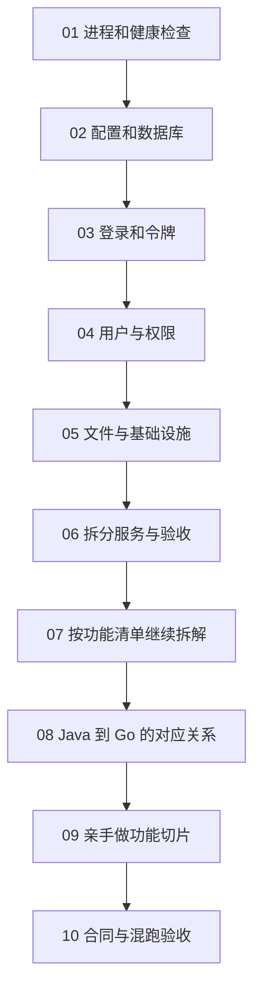

# 重构过程：从 Java 基线到 Go 服务

这一部分记录怎样把固定版本的 `yudao-cloud-mini` system、infra 能力拆成可实现、可测试的小步骤。它是项目的**附加阅读路径**：想直接运行服务，请看[使用说明](../usage/index.md)；要参与现有代码开发，请看[开发说明](../development/index.md)。想自己从头实现时，再按这里的顺序动手，并与本仓库源码对照。

每一站都先固定 Java/Vben 的外部合同，再做一个最小闭环：请求从哪里来、规则在哪里算、数据从哪里取、用什么测试证明结果对。不要先照着 Go 源码抄一遍。

| 站点 | 这一站拆成的小任务 | 做完后看本仓库哪里 |
| --- | --- | --- |
| [01：先把服务跑起来](01-server.md) | Go module → HTTP → 响应壳 → 配置 → 优雅退出 | `cmd/server`、`internal/platform/httpx`、`config` |
| [02：把数据接上](02-data.md) | MySQL 连接 → 查询接口 → 实现 → Redis → 集成测试 | `internal/platform/db`、`internal/platform/cache`、`internal/system/auth/store.go` |
| [03：登录切片](03-auth.md) | 密码校验 → 状态/租户 → 签令牌 → 刷新/登出 → 错误和日志 | `internal/system/auth` |
| [04：用户和权限](04-directory.md) | 用户 CRUD → 部门范围 → 角色/菜单 → 缓存失效 → 导入导出 | `internal/system/directory`、`permissionrpc` |
| [05：文件和基础设施](05-infra.md) | 上传 → 存储器接口 → 本地/S3 → 元数据 → 删除/下载 | `internal/infra/file` |
| [06：从单体走到拆分](06-distributed.md) | 多入口 → Nacos → RPC → Java 混跑 → 浏览器/回滚 | `cmd/*`、`internal/platform/app`、`internal/platform/nacos` |
| [07：把其余功能拆细](07-feature-map.md) | system、infra、平台能力按最小闭环继续做 | 按表逐包对照 |
| [08：Java 到 Go](08-java-to-go.md) | Controller/Service/Mapper、Context、事务与错误 | `internal/system/auth` |
| [09：功能切片实战](09-feature-slice.md) | 定合同 → 小接口 → MySQL → handler → 测试 | `internal/system/sendrpc` |
| [10：合同验收练习](10-contract-lab.md) | 单元、集成、混跑、浏览器与回滚证据 | `internal/platform/app` |

## 每一站留下什么

1. 一张外部合同小表：路径、字段、权限、租户、失败返回和副作用。
2. 一条能独立运行的功能切片：入口、用例、数据适配器及必要配置。
3. 对应的单元或集成测试，记录实际执行与跳过项。
4. 一段简短的设计说明：为什么这样拆，与 Java 实现有什么区别。

**完成这些练习不等于线上平替**：线上验收还要按[测试说明](../development/testing.md)和[兼容范围](../usage/compatibility.md)做。碰到 Java 行为不清楚时，查固定 SHA 的源码，不要照着 Go 猜。

自己跟做时，建议每个小任务留一个提交，正文记下测过什么、还不确定什么。这样以后回看，能分清功能实现、设计取舍和验收证据。

公开仓库的 Git 历史经过整理，**不能拿提交数量当重构步骤**。这十站与源码测试给出可重复的路径；更细的逐轮审查记录留在维护者的重写工作区。运行和部署仍以当前 `main`、[使用说明](../usage/index.md)及每站检查点为准。
