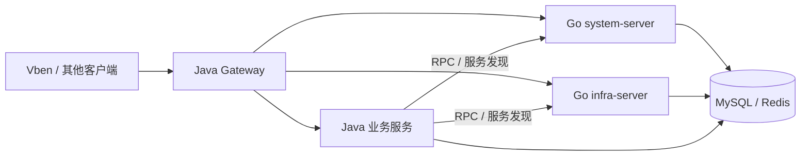

# Java / Go 基础服务能力对照

本项目要把芋道 Cloud 的 **`system`、`infra` 等基础服务**逐步交给 Go 承担，让它们与继续运行的 Java 业务服务组成一个系统。业务服务不是这次重写的对象；Java Gateway 在拆分部署中继续负责入口。Go 的 `cmd/server` 只是把当前两个基础模块合在一个进程里，不能代替包含其他业务模块的完整 Cloud。

## 对照范围和统计口径

以下清单在 2026-09-25 根据 [yudao-cloud-mini 固定提交](https://github.com/yudaocode/yudao-cloud-mini/tree/712fc7c2528e434217833bf04e438bf18a9c96e4)（v2026.08 / JDK 25）和本仓库 `f94622c3550553cc67fc9a1d39addedcd541f2ef` 统计。Java 根 POM **启用** `system`、`infra`、Gateway 和聚合入口；会员、工作流、支付、商城等模块在该 POM 中仅是注释，不能拿它们计算 Mini 的完成率。实际生产环境运行哪些 Java 业务服务，还要以部署清单和调用链核实。

表中的 `命中/基线` 是**静态路由覆盖**：把 Java Controller 注解、Feign 声明展开为唯一的 `HTTP 方法 + 完整字面路径`，与 Go 注册的路由比较。同一路径只计一次。它回答“有没有相应入口”，不回答请求字段、返回值、权限、租户、事务、缓存、外部副作用或性能是否一致。因此下面的分数**不是功能完成率，也不是生产替换率**。

| 服务 | 目标运行方式 | Java Controller 路径在 Go 命中 | Java Feign 路径在 Go 命中 | 当前判断 |
| --- | --- | ---: | ---: | --- |
| `system-server` | Go `cmd/system`；切换前可与 Java 实例对照 | **212/212** | **56/56** | 入口覆盖很高，仍需逐功能差分验收 |
| `infra-server` | Go `cmd/infra`；切换前可与 Java 实例对照 | **101/102** | **6/6** | 文件下载路由通配符写法不同，仍需运行时验证 |
| `yudao-gateway` | 继续使用 Java Gateway | 不适用 | 不适用 | 不属于 Go 重写范围；要验证它与 Go 服务发现、转发和鉴权的配合 |
| Java 业务服务 | 保留 Java 实现，按现有部署接入 | 不适用 | 不适用 | 本仓库不计算其重写完成率；要验证它们调用 Go 基础服务的契约 |

这张图是**目标边界**，不是已验收的线上拓扑。切换前可以让 Java `system`、`infra` 保留为回切目标；同名服务同时注册时，必须有明确的实例隔离和流量规则，不能让 Nacos 随机混用两种实现。[部署与回滚](deployment.md)说明检查顺序。

## `system`：按功能拆开看

| 功能组（Java Controller） | 典型能力 | Controller 命中/基线 | Feign 命中/基线 | Go 代码入口 |
| --- | --- | ---: | ---: | --- |
| 登录与验证码 | 登录、登出、刷新令牌、验证码 | 12/12 | 0/0 | `internal/system/auth`、`internal/system/captcha` |
| 用户、部门、岗位 | 用户资料、部门树、岗位和导入导出 | 36/36 | 16/16 | `internal/system/directory` |
| 角色、菜单、权限 | 角色授权、菜单、权限校验 | 22/22 | 7/7 | `internal/system/directory`、`internal/system/permissionrpc` |
| 字典与地区 | 字典类型/数据、地区、应用端查询 | 22/22 | 2/2 | `internal/system/directory`、`internal/system/area` |
| 租户与套餐 | 租户维护、套餐、应用端租户信息 | 19/19 | 2/2 | `internal/system/directory`、`internal/system/tenantrpc` |
| OAuth2 与社交 | 客户端、令牌、授权、社交绑定 | 28/28 | 17/17 | `internal/system/identity`、`internal/system/auth` |
| 邮件 | 账号、模板、发送日志 | 19/19 | 2/2 | `internal/system/message`、`internal/system/sendrpc` |
| 短信 | 渠道、模板、验证码、回执和日志 | 25/25 | 5/5 | `internal/system/message`、`internal/system/auth` |
| 公告与站内信 | 公告、通知模板、消息 | 23/23 | 2/2 | `internal/system/message`、`internal/system/sendrpc` |
| 登录与操作日志 | 查询、记录登录与操作日志 | 6/6 | 3/3 | `internal/system/logger` |
| **合计** |  | **212/212** | **56/56** |  |

这里的 Controller 组是按 Java 类职责归类；Feign 组按调用用途归类，二者不是同一组接口。Go 源码中的包名会随迭代调整，找具体路径时应以路由注册和测试为准。

## `infra`：按功能拆开看

| 功能组（Java Controller） | 典型能力 | Controller 命中/基线 | Feign 命中/基线 | Go 代码入口 |
| --- | --- | ---: | ---: | --- |
| 文件与存储配置 | 上传、读取/下载、文件配置 | 18/19 | 2/2 | `internal/infra/file` |
| 参数与数据源 | 参数配置、数据源配置 | 14/14 | 1/1 | `internal/infra/config`、`internal/infra/datasource` |
| 代码生成 | 表导入、字段配置、预览与生成 | 11/11 | 0/0 | `internal/infra/codegen` |
| Redis 监控 | 缓存信息 | 1/1 | 0/0 | `internal/infra/redismonitor` |
| 访问与错误日志 | API 访问/异常记录与查询 | 7/7 | 2/2 | `internal/infra/apilog` |
| 演示模块 | 联系人、分类、学生三种数据模型 | 50/50 | 0/0 | `internal/infra/demo01`、`demo02`、`demo03` |
| WebSocket 发送 | 内部消息推送 | 0/0 | 1/1 | `internal/platform/ws` |
| **合计** |  | **101/102** | **6/6** |  |

唯一未按**字面路径**命中的 Java Controller 是 `GET /admin-api/infra/file/{configId}/get/**`；Go 使用 `GET /admin-api/infra/file/:configId/get/*objectPath`。两种框架的通配符语法不同，不能仅用字符串比较判断缺失。仍需用真实文件名、编码字符、MIME、存储后端和错误路径做 Java/Go 差分。代码生成也要比较生成的文件内容，不能只看 11 个入口。

## 继续由 Java 承担的部分

| 范围 | 本项目的处理 | 为什么没有 Go 完成率 |
| --- | --- | --- |
| Gateway | 保留 Java 实现，核对转发、鉴权、限流、灰度与 Nacos | 不在 Go 重写范围 |
| 会员、工作流、支付、商城等业务模块 | 保留 Java 服务，通过约定的 HTTP/RPC、数据库与缓存同 Go 基础服务协作 | 固定 Mini 基线未启用这些模块；没有逐服务功能清单和线上拓扑，不能虚构分母 |
| Vben 管理端 | 沿用固定版本并做端到端联调 | 前端不是 Go 服务 |

固定 Mini 根 POM 还列出下列**未启用的模块占位**。它们是未来异构系统中可能继续运行的 Java 业务领域，不等于当前目标环境已部署；对应功能、接口数和跨语言调用要从实际使用的完整 Cloud 版本重新盘点。

| Java 模块（Mini POM 中注释） | 对应领域 | Go 重写进度 |
| --- | --- | --- |
| `member` | 会员 | 不在范围；保留 Java |
| `bpm` | 工作流 | 不在范围；保留 Java |
| `pay` | 支付 | 不在范围；保留 Java |
| `report` | 报表 | 不在范围；保留 Java |
| `mp` | 公众号 | 不在范围；保留 Java |
| `mall` | 商城 | 不在范围；保留 Java |
| `crm` | 客户关系 | 不在范围；保留 Java |
| `erp` | 企业资源管理 | 不在范围；保留 Java |
| `iot` | 物联网 | 不在范围；保留 Java |
| `mes` | 生产制造 | 不在范围；保留 Java |
| `wms` | 仓储 | 不在范围；保留 Java |
| `im` | 即时通信 | 不在范围；保留 Java |
| `ai` | AI 应用 | 不在范围；保留 Java |
| `hrm` | 人力资源 | 不在范围；保留 Java |
| `fms` | 财务管理 | 不在范围；保留 Java |

如果将来决定让 Go 承担另一个基础服务，先固定对应的 Java 版本和接口清单，再单独补比较表与测试。这个决定不改变当前 Java 业务服务保留的目标。

## 距离可切流还差什么

当前 `system`/`infra` **不是空壳**：管理接口、内部调用入口和相应业务包已经大面积落地。但“路径已注册”之后仍要按真实调用图验证：

1. 同一请求分别打到 Java/Go，比较字段、错误码、鉴权、租户和数据权限，以及数据库/Redis 的副作用。
2. 让保留的 Java 业务服务实际调用 Go 的 `/rpc-api/**`；验证令牌、缓存、服务发现、失败重试和网络边界。
3. 用固定 Vben 在浏览器覆盖登录、菜单、常用管理操作、失败路径；文件、短信、代码生成等做专项对照。
4. 在目标环境演练实例切换、观测、回切及共享数据恢复，之后再做同规格压测。

目前可用于本机开发与隔离环境联调，**尚未凭这张表取得线上切流许可**。验收细则见[兼容范围](compatibility.md)和[测试与验收](../development/testing.md)。
