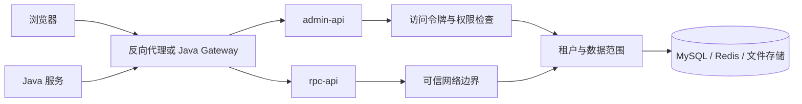

# 安全边界：哪些保护在代码里，哪些依赖部署

0.0.1 是开发预览版。这里讲的是当前实现的信任边界，方便你在本机实验、写新接口和做混跑验收时知道要检查什么；它不是安全认证。

## 请求从哪里进来

| 边界 | 当前做法 | 部署时必须补的条件 |
| --- | --- | --- |
| 管理接口 | 通过令牌、权限、租户和具体业务规则检查 | TLS、入口限流、真实浏览器负向用例、日志脱敏 |
| `/rpc-api/**` | 与 Java Feign 契约对齐，部分路由读取 `tenant-id` | **只允许可信服务访问**；`tenant-id` 不是调用者身份认证 |
| MySQL/Redis | 启动时连接失败会退出；令牌和缓存共用 Redis | 最小权限账号、网络隔离、备份恢复、不同环境独立凭据 |
| 文件存储 | 上传大小、路径与部分配置在代码里校验 | 存储器权限、对象生命周期、下载授权、异常样本实测 |
| 外部短信/邮件/社交 | 凭据从环境或数据库配置读取 | 真实渠道密钥不进测试/日志，发送频控和回调来源校验 |

## 密钥怎么放

`YUDAO_MYSQL_DSN` 与 `YUDAO_MYBATIS_ENCRYPTOR_PASSWORD` 没有可用于生产的内置值；启动前必须提供。开发脚本生成随机的本机密钥，只能给新建的练习数据使用。读取已有 Java 密文时，要使用与原数据匹配的密钥；更换密钥涉及重加密和回滚计划。

`.env` 被 Git 忽略，但“被忽略”不等于安全。不要在 Issue、PR、截图、命令输出或测试日志中贴明文。部署时从受控配置源注入，限制读取权限；换密钥时同时检查旧令牌、缓存、数据库密文和 Java 实例的行为。

## 写新功能时逐项检查

1. **身份**：这个入口允许匿名、管理员、会员还是内部服务？令牌无效、过期、登出后分别怎样返回？
2. **租户**：所有读写 SQL 是否带租户条件？缓存键、文件路径、异步任务和 RPC 也要检查。
3. **数据范围**：列表、详情、导出和批量操作是否用同一套可见范围？不能先读全量再在 Go 内存中过滤。
4. **副作用**：写库成功但缓存失效失败、对象已写但文件记录失败时，调用方能否知道并恢复？
5. **日志**：密码、验证码、令牌、短信/邮件收件人及数据库口令不应进入日志。
6. **外部输入**：上传路径、文件大小、表名、排序字段、回调 URL、代码生成模板参数都要限定来源。

安全相关测试最好覆盖**允许、拒绝和跨租户**三个结果。单元测试只能证明某个用例的规则，生产入口的网络边界还要在目标拓扑上检查。已有风险与发布门槛见[兼容性说明](compatibility.md)和[测试手册](../development/testing.md)。

## 报告问题

不要在公开 Issue 中贴可利用的细节或真实数据。按 [SECURITY.md](https://github.com/weilhuang/yudao-cloud-go/blob/main/SECURITY.md) 使用 GitHub 私密漏洞报告。维护者收到后先复现，再决定修复、回归和披露。
